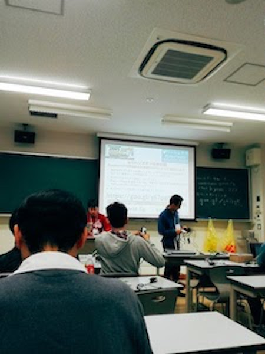
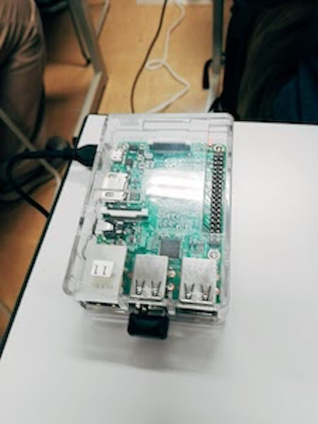
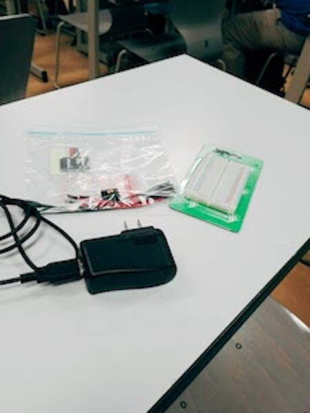
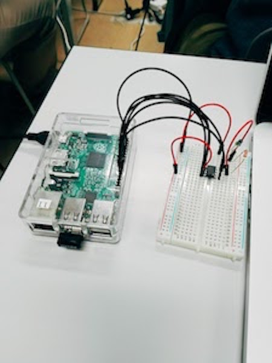
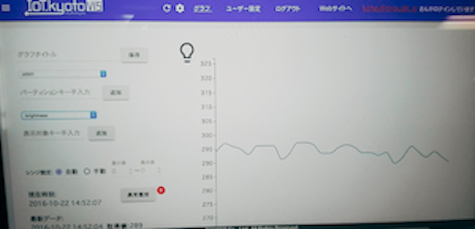
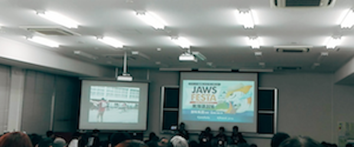
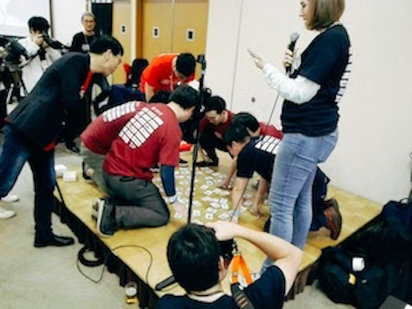
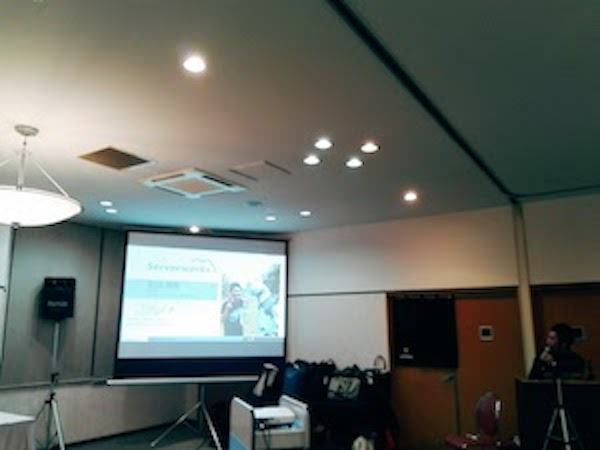
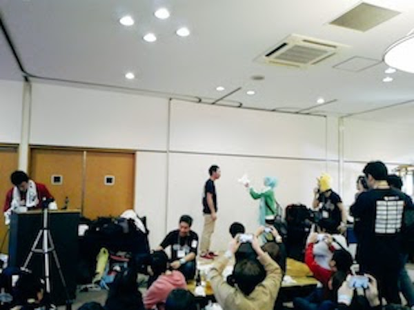

10/22(土)に開催された、[JAWS FESTA 2016](http://jft2016.jaws-ug.jp)に行ってきました！
 

 
2013 関西、2014 東北、2015 九州と続き、2016は東海道！場所は名古屋。
会場は名古屋工業大学で開催されました。

学生や子連れの方とかも結構参加していて、今までJAWS DAYSとかしか参加してなかったのでとても新鮮でした。

 
10:00開場でオープニングは11:00から。5111教室で元AWS Enterprise Evangelistの渥美さんが「金融クラウド＆FINTECH最前線。～AWSで金融からイノベーション！」という題目で金融クラウドをとりまく業界動向とその背景、今後の動きについて話してくださりました。

出典：[JAWS FESTA facebook](https://www.facebook.com/JawsFesta/)

 
お昼(12:00ころ)からはAWSジャパンさん、cloudpackさん、サーバーワークスさんなどのいろんな企業さんがランチセッションを開いてお昼ご飯を食べながらの講演会もありました。

 
そして13:00！いよいよ楽しみにしていた"IoTハンズオン「RaspberryPiで照度計の計測値をAWSに送って可視化しよう」"が始まります。
 
実は今回のFestaでは、
- 13:00〜14:50 [【前半の部】IoTハンズオン「RaspberryPiで照度計の計測値をAWSに送って可視化しよう」](http://jft2016.jaws-ug.jp/speaker/345)
- 15:00〜16:50 [【後半の部】IoTハンズオン「ミニチュアIoT家電をAWS IoT + SORACOM Beamで制御してみよう」](http://jft2016.jaws-ug.jp/speaker/349)
というのに参加を申し込みしています。
このセッションは具材準備などの関係もあって事前登録制で有料です。といっても通しで1300円くらい。安いですね！

 
**【前半の部】IoTハンズオン「RaspberryPiで照度計の計測値をAWSに送って可視化しよう」**
ここでのハンズオンでは、
・ラズパイとブレッドボードを使って、簡易照度センサーを作り、そこで取得した値をDynamoDBへ格納
・[IoT.kyoto](http://www.iot.kyoto)がDynamoDBに格納したデータを取り出して可視化する
ということを行いました。

つまりこれと、

これで、

これを作りました！

そして、ラズパイでプログラムを動かして照度値を取得します。

バッチリ動いてますね。

そしたら、この値をDynamoDBへ送って、http://www.iot.kyotoで可視化で完了です。

こんなことをやりました。めちゃくちゃ面白かったです！

なのでぜひご興味のある方はトライしてみてください。
[RaspberryPiでセンサーデータをfluentdを使ってDynamoDBに送って可視化してみよう＜完全編＞](http://qiita.com/Ichiro_Tsuji/items/fce61bdd5974a2c9cf14)

 
**【後半の部】IoTハンズオン「ミニチュアIoT家電をAWS IoT + SORACOM Beamで制御してみよう」**
ここでのハンズオンは、
・ラズパイでミニチュアライトを作成してPythonプログラムでライトのオン・オフを制御させる
・それをSORACOM BeamとAWS IoT Thingsを使って手元のPCからオン・オフをリモート制御できるようにする
といことを行いました。

すみません。。。後半はバタバタしてて完全に写真撮るのわすれました。。。

なので知りたい方は是非以下をトライしてみてください。
[「SORACOM x RaspberryPi ハンズオン 〜超音波センサー編〜」](https://github.com/soracom/handson/blob/master/ultrasonic-sensor/seminar.md)
[ミニチュアIoT家電をAWS IoT + SORACOM Beamで制御してみよう](http://qiita.com/dietposter/items/62c64c9f479144cb6469#step-21aws-iot-thingsを作成)

 
FESTAの最後はパネルディスカッションです。

 
ハンズラボ長谷川さんがモデレーターをし、パネラーとして元AWSの小島さん、さくらインターネットの田中さん、サイボウズの伊佐さんが登壇されました。
普段は話せないあんなことやこんなことを話してくださりあっという間のディスカッションでした。

 
そしてFESTAの後は懇親会へ！

 
さすがに大学でドンチャン騒ぎはできませんねw
場所を「サッポロビール 名古屋ビール園 浩養園」へ移しスタートです。

 
AWSカルタや、

 
LT大会。

 
もちろんパイ投げもw

 
ということでとても楽しい1日でした。

 

出典：[AWS User Group Japan](http://jft2016.jaws-ug.jp)

 
運営の皆様。楽しい時間をありがとうございましたm(__)m
運営の皆様。楽しい時間をありがとうございましたm(__)m
