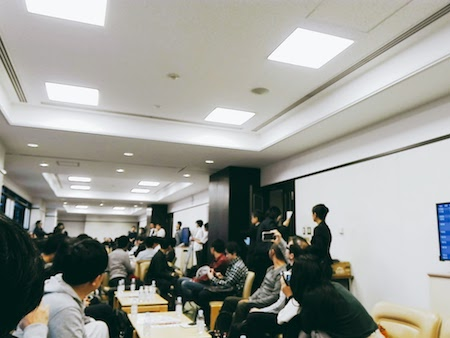
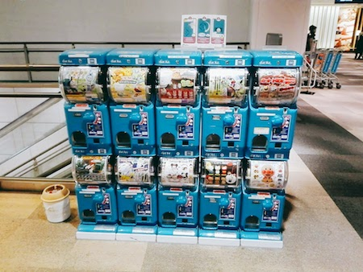
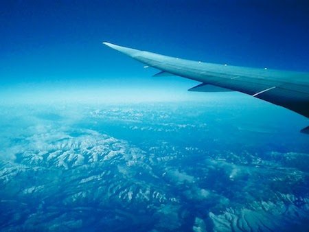
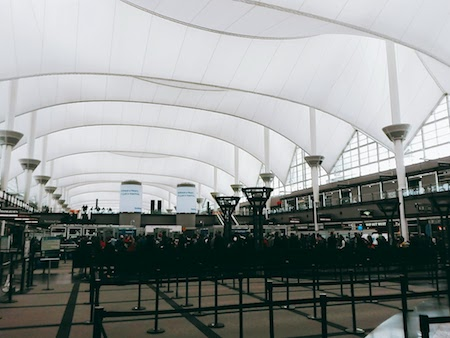
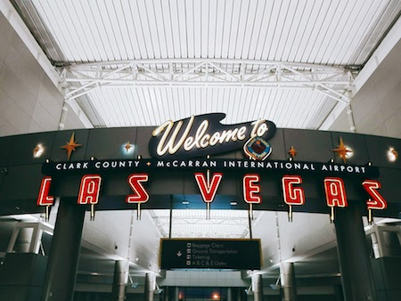
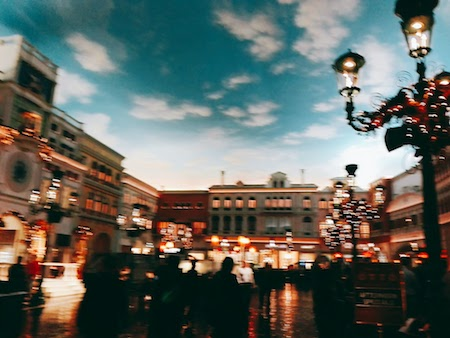
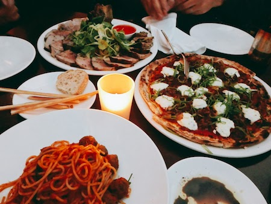

**11/28(月)〜12/2(金)**の４日間のAWSイベント[**re:Invent**](https://reinvent.awsevents.com)に今年も参加しに来ています。
英語とか全然なので、色々手配するのが面倒な自分は今年も安定の[**ジャパンツアー**](https://www.pts.co.jp/corp/reinvent2016/)での参加ですw
ただ、今回は諸事情により早めに帰らなければならないので４日目が終わった深夜帰るBコースでの参加です。

ということで今日の一日を振り返ってみたいと思いますー。

 
# 出発
**15:30** とりあえず成田国際空港 第１ターミナル南ウィング４階 出発ロビーにて受付をします。
ツアーなのでPTS(担当旅行会社)の方が「AWS re:Invent 2016 ジャパンツアー」と看板をわかりやすく掲げてくれているのでなんとなく行けばわかりますw

**15:40** 受付が済んだらそのまま搭乗手続きへ。チェックインはタイミングが悪いと混んでしまいますが今回はすんなり完了です。トランクもここで預けます。

**16:00** 毎年恒例の結団式へ！ここでラスベガスへの思いを昂らせます。「いっぱつ当てるぞー！」。。。あ、違いました。「いっぱい学ぶぞー！」

**17:30** 結団式も終わり、そのまま搭乗手続きを行います。

**18:15** 行ってきまーす！トランジット先のデンバーへ。

 
# トランジット
**12:35** 難なくデンバーへ到着し、次の飛行機まで２時間以上とかなりの暇を持て余します。

あ、ちなみに記載のタイムは現地時刻で記載していきますのでJSTだと大体7時間マイナスしてプラス１日してください。

**15:50** いよいよ最終目的地のラスベガスへ！さっきの飛行機で寝てなかったからもうへとへとです。。。爆睡です。そりゃ、よだれも垂らしますよね。

 
# 到着
**17:00** やっと、やっとのラスベガスに到着です。ツカレタ。。。

**18:00** ホテルに到着&チェックイン。ベネチアンも今回で４回目なのでもはや慣れたものです。とにかく頷いてサインしとけばいいんです。信用第一！というか今回の受付のお兄さん、部屋までの行き方とかwi-iの設定の仕方とかとても親切に教えてくれて驚きでした。

とそんな感じの１日でした。

 
# ディナー
今回はベネチアンの上のちょっとしたレストラン街の[OTTO](https://www.venetian.com/restaurants/otto-enoteca-pizzeria.html)というお店でピザやパスタを食べました。

明日はイベントの様子を書けたらなと思います。。。書けるかな。。。
