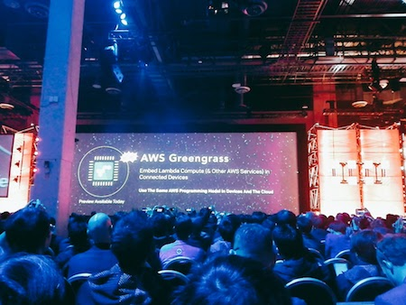

今日はいよいよキーノートです。キーノートといえばやっぱり新サービスの発表。
毎回どんな新サービスが発表されるのか楽しみで仕方ない人は数知れず。

始まるまではDJが会場を盛り上げます。

 
# Keynote presented by Andy Jassy
DAY 3とDAY 4はKeynoteがあります。そのDAY 3ではAWS CEOのAndy Jassyがプレゼンターとして話します。

話す内容はまず過去のAWSを振り返り現在の状況について、そして今後のロードマップを話すとともに、AWSを支える各企業を紹介します。
またその中でもAWSが注目する企業の偉い人が「なぜAWS選んだのか？」を話します。つまり様々な角度からAWSの良さをアピールしてくるわけです。
これって本当に凄いことだなーって素直に思いました。だって、企業が抱えている悩みをいち早く汲み取って、しっかり応えてきてるから今があるってことですよね。
そしてキーノートといえば一番はやはり新サービスの発表ですね。
今回もたくさんの新サービスが紹介されました。

 
# インスタンスの追加&次世代インスタンス
今までのインスタンスに新しいインスタンスが追加されたり次世代インスタンスが発表されました。
T2、Rファイミリーに新しいインスタンスが追加です。

 
## ・追加インスタンス
T2.xlarge・・・16GiB,2vCPUs
T2.2xlarge・・・32GiB,2vCPUs

 
## ・次世代インスタンス
R4・・・488GiB,DDR4,L3cache,64vCPUs
I3・・・3.3millionIOPS,488GiB,15.2TB NVMeSSD,6vCPUs
C5・・・72vCPUs,Skylake,12Gbps to EBS,144Gib

そのほかEC2関連での新サービスもたくさんありました。

 
# Elastic GPUs For EC2
これはEBSに直接アタッチできるサービスみたいです。もはやそんなことできちゃうんだ。。。

 
# Amazon Lightsail
簡単にVPSが作れるサービスです。VPCもセキュリティグループもパッケージ提供されているのでシンプルなのであればこれでちょこっとサクッと作れて便利ですね。

 
# F1インスタンス
インスタンスファイミリーの追加と進化だけでなく新しいインスタンスファミリーが登場しました
これはField Programmable Gate Arraysという通称FPGAを搭載したインスタンスです。

 
# Amazon Athena
S3に保存したデータに対し直接SQLを実行できるサービスです。これによってデータをダウンロードしないで済むのでとてもシンプルですね。

 
# Amazon Rekognition
画像認識、Deep Learningのサービスです。顔認識や表情分析が行えます。顔のマッチングなんかも。

 
# Amazon Polly
テキストスピーチサービスです。すでに26の言語に対応しているとのこと。もちろん日本も対応済みです。

 
# Amazon Lex
音声認識と言語認識のサービスです。Lexが受け取った音声をLambdaで処理することができます。
名前からもピンと来たと思いますが、Alexaに適用されています。

 
# PostgreSQL For Aurora
その名からわかると思いますがPostgreSQLをAuroraに変換するサービスです。
やっぱ来ましたねw

 
# AWS Greengrass
IoTデバイスにLambdaを組み込んじゃうサービスです。これはまたびっくりでした。
これからのIoTにものすごく関わってくるサービス間違いなしですね。

 
# AWS Snowball Edge
あのスノーボールが進化を遂げました。パフォーマンスの向上と共にストレージサイズが100TBに。
クラスタリング機能とS3エンドポイントの利用も可能になったとのこと。
そして何よりタッチスクリーンもカラーになったと！w超進化ですね！

 
# AWS Snowmobile
えっと。進化はさらに続いたようでした。
100PBのデータを扱うことができるコンテナトラックの登場です。実際に会場に来た時は「まじかw」と凄すぎて笑うしかなかったです。
100Gbpsのネットワークでデータ転送が26年かかるところ、Snowmobileなら6ヶ月で済むとのこと。超時短ですね。

ということで以上が本日のキーノートで発表された新サービスとなります。

ささっと一言まとめみたいにしたので詳しい内容は[AWSブログ](https://aws.amazon.com/jp/blogs/news/)を呼んでもらえればとw

 
# re:Play
re:Inventoの打ち上げです。毎回その時旬のDJを呼んで行うクラブイベントです。

出演するDJはキーノートの最後に発表されるのでそれまで誰も知りません。
去年はサマソニにも出演したZEDDが場を盛り上げました。

今年は誰でしょうかね？予想としては[Calvin Harris](https://soundcloud.com/calvinharris)か[DAVID GUETTA](https://soundcloud.com/davidguetta)あたりが有力なのではないかなと思っています。
AVICII引退しちゃいましたので。。。

何はともあれre:Inventもあとわずか！思いっきり味わいたいと思います。
