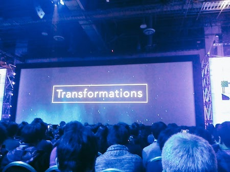

いよいよ僕のre:Inventも最終日となりました。
本日のキーノートはAWS CTOのWarner Vogelsです。

テーマは「Transformations(変革)」とのこと。

ということでスクリーンにはトランスフォーマーが!?

ちなみに彼が着ているTシャツもトランスフォーマーでしたw

CTOなだけあって彼の話は技術的な視点からの話が多いです。なので個人的には昨日よりこっちの方が好きかもw

そして本日もたくさんの新サービスが発表されましたー。

 
# AWS OpsWorks for Chef Automate
Chef AutomateをOpsWorksで利用できるようになりました。ただ日本はまだです。

 
# Amazon EC2 Systems Manager
EC2インスタンスやオンプレミスの構成管理をするサービスです。
パッケージのインストールやパッチ適用、リソース管理などのオートメーション化を実現させることができるとのこと。しかも無料！
運用する側としてはとても助かるサービスですね！

 
# AWS CodeBuild
ソースのコンパイルと単体テストを行うサービスです。
これでSource(AWS CodeCommit) → Build(AWS CodeBuild) → Deploy(AWS CodeDeploy)という一連の流れがAWSで完結できるようになりましたね。

 
# AWS X-Ray
EC2やECS、ElasticBeanstalkなどで実行されるコードからトレースデータを細くすることができるサービスです。

 
# AWS Personal Health Dashboard
AWSリソースに関するメンテナンスイベントを集約してくれるサービスです。
AWSサービスのメンテナンス通知やサービス障害情報を統合してくれるのでとても助かります。

 
# AWS Shield For Everyone
ネットワークとトランスポートレベルのDDos攻撃を防ぐためのサービスです。
無性版と有償版があり、デフォルトだと無性版が機能ONの状態だそうです。

 
# AWS Pinpoint
モバイルアプリケーション向けターゲットプッシュ通知サービスです。
今までAWSには情報を集めて解析するところまでしかなかったところにアクションを起こすサービスが登場しました。

 
# AWS Glue
S3やRDS、Redshiftなどに保存したいろんなデータソースを加工、ロードができるサービスです。

 
# AWS Batch
フルマネージドなバッチ処理実行サービス。
クラスタ管理なしで並列非同期処理を行えるとのこと。さらに課金対象は起動したリソース分のみでサービス自体は無料で利用できるところも良いですね。ただしまだバージニアのみ。

 
# Blox
ECS向けのコンテナ管理やオーケストレーションが行えるOSS。

 
# C# In AWS Lambda
LambdaにC#が登場です。bashはやっぱなかったかw

 
# AWS Lambda@Edge
LambdaファンクションがCloudFrontで出来ちゃうんですか!?すごいですね。
サーバレスへの勢いを加速させるサービスですね。

 
# AWS Step Functions
ワークフローをデザインしてステップ管理ができるサービス。これもまたサーバレスへの勢いがさらに加速ですねw

以上が２日目の新サービス発表でした。

さすがAWSと思わず言っちゃいました。ちゃんとServerlessへの波を掴んでるどころか自分たちで作り上げようとしてるんですから。

 
# re:Play
そしていよいよ本日のパーティーre:Playです。
さすがに前回がZEDDだっただけに今回以上はないかなと思っていたのですが。。。Martin Garrixとのこと。
2012年にデビューしてまだミニアルバムしか出したことないのにDJ Magでランキング１位。それでいて年齢もまだ20歳。まさに今回の「Transformation（変革）」ですね。
<blockquote class="instagram-media" data-instgrm-captioned data-instgrm-version="7" style=" background:#FFF; border:0; border-radius:3px; box-shadow:0 0 1px 0 rgba(0,0,0,0.5),0 1px 10px 0 rgba(0,0,0,0.15); margin: 1px; max-width:658px; padding:0; width:99.375%; width:-webkit-calc(100% - 2px); width:calc(100% - 2px);">
 
 

 
 <a href="https://www.instagram.com/p/BNoAud3BiYT/" style=" color:#000; font-family:Arial,sans-serif; font-size:14px; font-style:normal; font-weight:normal; line-height:17px; text-decoration:none; word-wrap:break-word;" target="_blank">re:Play Introducing The #1 DJ In The World.</a>
 
Kohei Yamadaさん(@maharikumaharitaaaaa)が投稿した動画 - <time style=" font-family:Arial,sans-serif; font-size:14px; line-height:17px;" datetime="2016-12-05T06:20:20+00:00">2016 12月 4 10:20午後 PST</time>

</blockquote> 

ということで最後の夜を楽しんで来ます。
