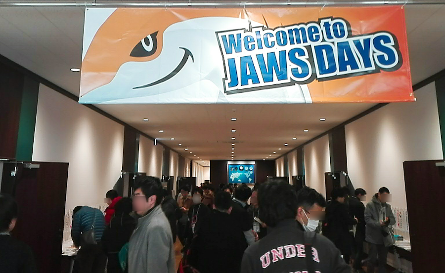

# はじめに
JAWS DAYS 2017に行って来ました。

場所はTOC 五反田メッセ。朝10:00から。

当日の来場者数は1,200人越えと、企業ではなくユーザーグループという一種のコミュニティだけの運営で参加数はすごいです。

会場内は8つのトラックと1つの休憩/充電スペースの9つに区切られていました。
そしてなんと！？今年から託児ルームまで!!

AWSユーザーの幅広さが伺えると同時に運営されている方々の配慮が素敵ですね。
[**託児サービスについて**](http://jawsdays2017.jaws-ug.jp/about/childcare-service/)

 
# Session

今回はランチタイムセッションも含めて50以上のセッションが行われ、ジャンルもAIoTやDocker、サーバーレスなどをテーマにしたものやJAWS-UG支部からの発表などもありました。しかも韓国のAWS Korea User GroupやシンガーポールのAWS UG Singarporeまで。
AWSユーザーグループの活動はグローバルなんですね。

[**Session一覧**](http://jawsdays2017.jaws-ug.jp/session/)

 
# 懇親会＆LT大会

セッションが終わった後は懇親会です。ここではお楽しみのLT大会が行われました。
ここでは通常LTということもあって、軽い発表が行われるはずなのですが、、、
もうJAWS DAYSも5回目となるとLTのクオリティも高くてびっくりです。もはやLT芸人を名乗る人も出て来るくらいですからw
JAWS DAYS名物の一つとなってます。

 
# おわりに
朝から始まったJAWS DAYS 2017でしたが、あっという間の1日でした。
年々内容が濃くなっているJAWS DAYS。ジャンルも多くなって来ているので、このままいくとそのうち2日間開催とかになる日が来るんじゃないかなと、そんな気がしますw

