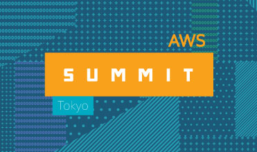
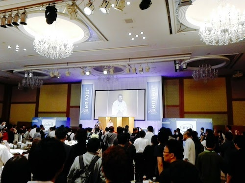

# AWS Summit Tokyo 2017
今年もAWS Summit Tokyo 2017 に行ってきました。

AWS Summit は 5/30〜6/2 に グランドプリンスホテル新高輪 で開催されるAWSに関するセッションやイベントです。

今回はパミール、飛天、アネックスという3つの会場で行われました。
昨年はパミール、飛天の２会場だったので規模が確実に大きくなってるのを感じます。

 
# Day2
Day1は[Dive Deep Day](http://www.awssummit.tokyo/divedeepday/index.html)というメディア、金融、製造業、公共機関等、業種やソリューションに特化したシンポジウムだったので行ってません。なのでDay2からの参加です。

 
とりあえずレジストリを済ませてから、パミール3Fへ移動。

 
EXPO会場は歩くのにも一苦労な混みっぷり。。。様々な企業がAWSを使ったサービスを展開しています。

とりあえずぶらぶらするだけでも勉強になります。

 

とりあえずAWSのブースにSnowbowlがあったので撮っときましたw
「使ってみたかったんですけどねー、東京リージョン来てないからなー」呟いたら、「個別でご相談いただければ対応も可能ですよ！」とAWS社員の方の一言が。。。!?
もう少し早く知っていれば。。。orz

 
# Day3
昨年まではDevelopers Conferenceという名前で行なっていたイベントですが、今回からは[AWS Dev Day Tokyo 2017](http://www.awssummit.tokyo/devday/index.html)と名前を変えて開催とのこと。

 
DevDayのセッションではAmazon CTO の Werner Vogels氏によるスタートアップ企業さんへの公開技術レビュー。

ただ、AWSを利用するだけじゃなく、どうやったら利益を出せるかと言ったところなども意識しながらサービスを構築すると言ったところはとても参考になりました。

 
そして、いよいよお待ちかねのナイトイベント。

 
会場中央にはピザやプルコギが並びます。

 
そしてオープニングでは落語を聴くことができました。人生初かもw

 
# Day4
Dev Day会場はServerless evolutionということで、Serverlessについてのセッションが目白押し。
一発目の西谷さんの「全部教えます！サーバレスアプリのアンチパターンとチューニング」から最後まで面白い話ばかりでした。
聴くのに夢中で写真撮るのも忘れてしまうほどにw

 
そして本日のナイトイベントはJAWS-UG Night。

 
JAWS-UG会長の中山さんの挨拶でスタートし、LT大会やクイズ大会と終始盛り上がっていました。

ということで、あっという間の１週間。今年もre:Inventが今から楽しみです。
