# はじめに
今年もAWSが開催する最大のイベント、[AWS re:Invent 2017](https://reinvent.awsevents.com)に行ってきました。

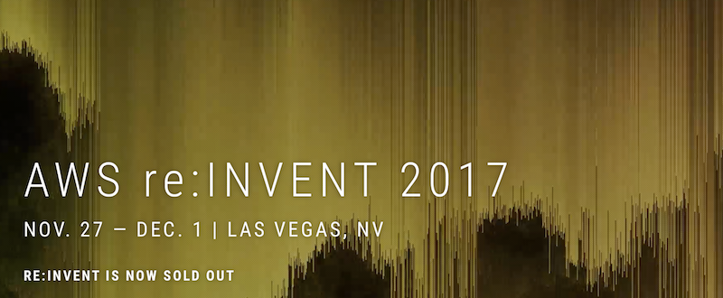

サービスも増え、参加人数も年々増加していくため、年を追うごとに規模が大きくなっています。
2013年の第２回目から参加していますが、当時はベネチアンとパラッツォという2つのホテルが共有するSands Expoという１つの会場のみで開催していたのが、今ではMirage、LinQ Lot、Encore、Aria、MGM Grandが追加され、全部で6会場での開催となりました。

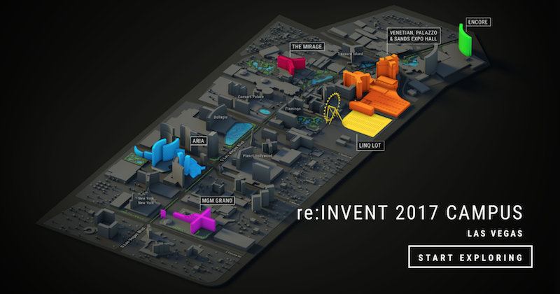

開催期間は現地時間で11/27-12/1の5日間です。

今回は前日の11/26にホテルチェックインしました。前日からレジストレーションが始まっていたため、ホテルに荷物を置いたらすぐにレジストレーションを済ませました。

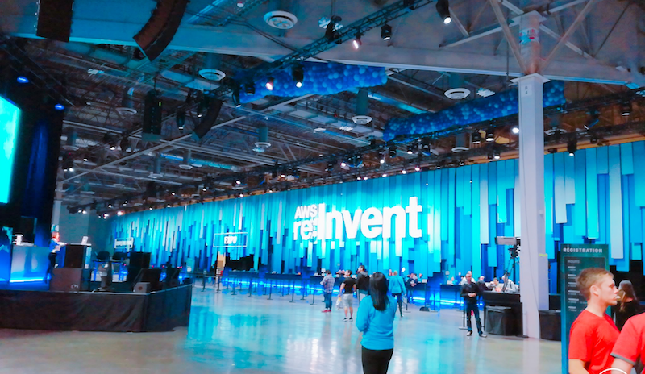

 
# 1日目(11/27)
いよいよre:Inventが始まりです。とはいえ特に開会の挨拶とかはないので、とりあえずイベントが用意してくれている朝食を食べに。
今回はサーバーレス関係のセッションが聴きたかったのでAriaという会場へ移動。今回から会場が増えたので移動の弊害が気になっていたのですが、会場間は無料シャトルバスが常に動いているのでそこまで不自由さは感じませんでした。

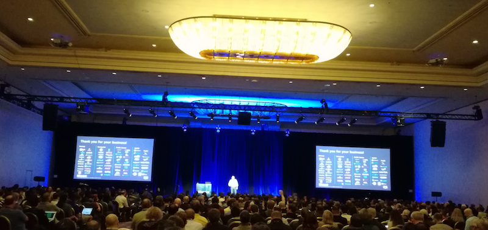

 
## SRV314:Building a Serverless PipeLine to Transcode a Two-Hour Video in Minutes
2時間分の動画のエンコードを数分で処理するのを実現させたアーキテクチャについての説明です。
LambdaやPipelineをベースに構築されていて、S3に動画をアップするとLambdaがその動画を数MB単位(だった気がする)で分割し、そのエンコードをまたLambdaで並列処理するという感じの流れでした。ざっくりですが。
もちろんセッションの名の通り全てサーバレスアーキテクチャで実現されています。

 
## SRV213-R:[REPEAT]Thirty Serverless Architectures in 30 Minutes
30分で30のサーバーレスアーキテクチャを紹介するというセッションです。
サーバーレスということでかなりの人気だったのか初日にして早速のリピートセッションでした。
CloudWatch+LambdaやS3+Lambdaといった基本的構成からIoT+LambdaやLex+Lambda、Alexa+Lambdaといった新しい技術を取り入れた構成を次々と紹介してくれるので参考になりました。セッションで利用したスライドはデザインパターンとして手元に置いておきたいです。

 
## THE QUAD AT ARIA

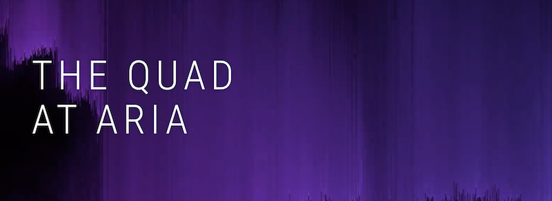

2つのセッションを聴いた後は、同じAriaにあるTHE QUAD AT ARIAというパートナー&スポンサーのブースフロアへ行きました。
「何をしてるところなんだろ？」と思って行きましたが、IoTや人工知能をメインにしたExpoというのがわかりました。
入ってすぐのところで手作りと思われるロボット系の工作機械展示ブースがあり、訪れた人に対し作った人がホワイトボードで熱く構造などについて語っていました。どれもちらっと見ただけですが、ただの「大人の工作」というレベルを遥かに超えた「大人の巧作」でした。
さらに奥に進むと近未来を感じさせるゲームセンタースペースやセッションの映像配信をしているシアターブースなどがあり、目当てのセッションがやっている場合はそこでも聴講することができました。

本日は２セッションのみ。実は他にも色々聴きたいセッションとかもあったのですが、予約制のためすぐ埋まってしまい聴く事が出来ませんでした。。。残念。
なので朝8:00から始まったイベント初日は17時頃で切り上げることにしました。明日の朝はもっと早いので。。。

[ACG AWS re:Invent 2017 - Day 1 Summary](https://youtu.be/tmGVJkqsAf8)

 
# 2日目(11/28)

あっという間の1日目が終わり、いよいよ緊張の2日目。本日はアクティビティとワークショップの2つにエントリーしているため、かなりハードな1日です。

## 4K RUN

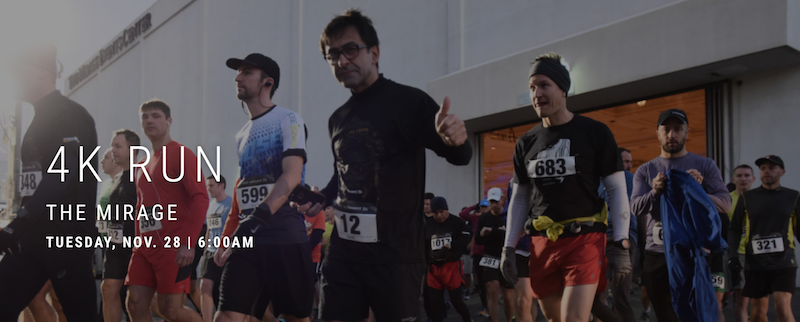

今回はこのために来たと言ったらさすがに言い過ぎですが、それくらい楽しみにしていたイベントです。
なんのイベントかというと、ただの「4kmマラソン」です。
MirageというホテルからAriaというホテルまでの距離が片道2kmなので、そこを往復するというイベントです。ただ走るだけですが、ラスベガスの公道を走る機会はなかなかないのでとても楽しみにしていました。
そしてこのイベントでの1位を密かに狙っていたのです。re:InventはITイベントなので「運動してる人なんていないでしょ？やってても軽いランニング程度でしょ？」と高をくくり、1位とは言わないまでも10位くらいはイケるんじゃないかなとかなり自信を持って臨みました。
が、しかし！「世の中そんな甘くはないですよ」と、これを書いてる自分はその時の自分に言ってやりたいです。
先頭集団に位置し合図とともにスタート。みんな予想以上の猛ダッシュ！？自分も離されないようついて走ります。
だいたい1km地点を過ぎたところでペースの確認。。。3分30秒/km！こんなガチレースになるとは。。。しかし先頭集団は速度が落ちるどころかグングン加速。甘い考えで臨んだ自分の心は見事に砕かれました。でもここで諦めるのは悔しいので、2km地点までになんとか心を整え、ベストを尽くすことに専念して走ることにしました。
結果としては、全体で25位。男性だけだと23位という結果になりました。参加者が1378人だったので、頑張ったなと思います。

[***KOHEI YAMADAの記録***](https://georesults.racemine.com/Elemental-Race-Timing/events/2017/aws-reinvent-4k-4charity-fun-run/1130/entrant/share)
[***レース結果一覧***](https://georesults.racemine.com/Elemental-Race-Timing/events/2017/aws-reinvent-4k-4charity-fun-run/results)

来年はもう少し上位を狙えるように頑張りたいと思います。

## Hackathon GameDay

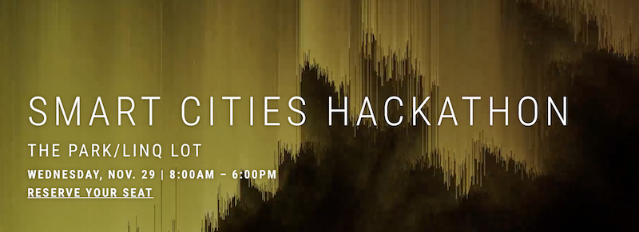

体の次は頭をフル稼働。という事でハッカソンのGameDayというのに参加しました。
とある企業の社員という設定から始まります。ある日突然会社のシステムがダウンしたので、復旧させてほしいとのこと。
ダウンしたサーバーは復旧できない。だけどシステムのソースはあるということで新規にサーバーを構築して復旧させることに。
そうしたら次は、社長はデザインがイマイチだというからカッコ良くしてくれと。。。
そんな感じで色々なお題が時間経過とともにどんどんやってきます。それをいかに早くクリアしてポイントを多く稼いだチームの勝利です。

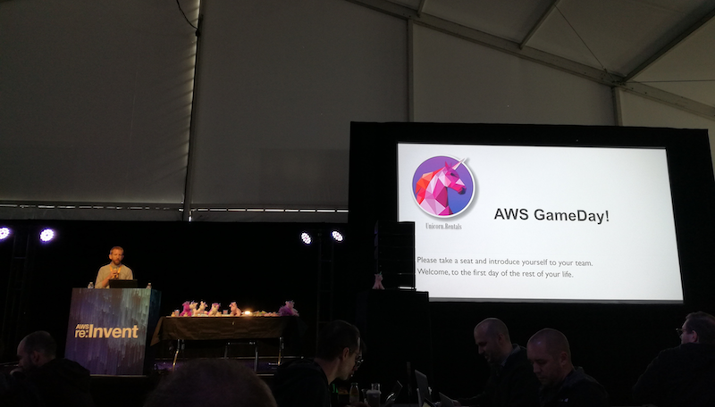

Machine learning、Big Date、DevOpsの3スキルが求められるゲームなのにほぼDevOpsのスキルしか持っていない人たちが集まりスタート。
はじめはDevOpsからだったので好スタートを切れましたが、他のスキルも徐々に必要になって行き気がつくとどんどん下の方へ。。。結果は惨敗でしたが、色々あって敢闘賞的なのをいただきましたw

[ACG AWS re:Invent 2017 - Day 2 Summary](https://youtu.be/VJ5Q2H8MaLI)

 
# 3日目(11/29)

すでに3日目ですが何気にここからが本番？と思ってしまうのはKeynoteがこの日から始まるからかなと思います。

## KEYNOTE : Andy Jassy

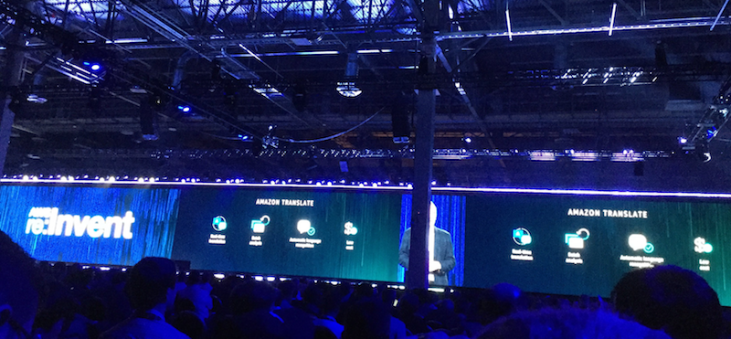

ここでは新サービスが発表されそれと同時に利用可能になります。普段でも新サービスの発表はありますがここでの発表は特別です。
毎回この日のためにでっかい新サービスや新機能が用意されています。
今回もたくさんの新サービスや新機能がありました。

**[一覧]**

・[AWS Elastic Container Service for Kubernetes(EKS)](https://aws.amazon.com/jp/blogs/aws/amazon-elastic-container-service-for-kubernetes/)
・[AWS Fargate](https://aws.amazon.com/jp/blogs/news/aws-fargate-a-product-overview/)
・[Amazon Aurora Multi-Master](https://aws.amazon.com/jp/blogs/news/sign-up-for-the-preview-of-amazon-aurora-multi-master/)
・[Amazon Aurora Serverless](https://aws.amazon.com/jp/rds/aurora/serverless/)
・[Amazon DynamoDB Global Table](https://aws.amazon.com/jp/blogs/news/new-for-amazon-dynamodb-global-tables-and-on-demand-backup/)
・[Amazon DynamoDB Backup and Restore](https://aws.amazon.com/jp/about-aws/whats-new/2017/11/aws-launches-amazon-dynamodb-backup-and-restore/)
・[Amazon Neptune](https://aws.amazon.com/jp/blogs/news/amazon-neptune-a-fully-managed-graph-database-service/)
・[Amazon S3 Select](https://aws.amazon.com/jp/blogs/news/s3-glacier-select/)
・[Amazon Glacier Select](https://aws.amazon.com/jp/blogs/news/s3-glacier-select/)
・[Amazon SageMaker](https://aws.amazon.com/jp/blogs/news/amazon-sagemaker/)
・[AWS DeepLens](https://aws.amazon.com/jp/deeplens/)
・[Amazon Rekognition Video](https://aws.amazon.com/jp/about-aws/whats-new/2017/11/introducing-amazon-rekognition-video/)
・[Amazon Kinesis Video Streams](https://aws.amazon.com/jp/blogs/news/amazon-kinesis-video-streams-serverless-video-ingestion-and-storage-for-vision-enabled-apps/)
・[Amazon Transcribe](https://aws.amazon.com/jp/transcribe/)
・[Amazon Translate](https://aws.amazon.com/jp/translate/)
・[Amazon Comprehend]()
・[AWS IoT 1-click](https://aws.amazon.com/jp/about-aws/whats-new/2017/11/aws-iot-one-click-now-in-preview/)
・[AWS IoT Device Management](https://aws.amazon.com/jp/blogs/news/aws-iot-device-management/)
・[AWS IoT Device Defender](https://aws.amazon.com/jp/iot-device-defender/)
・[AWS IoT Analytics](https://aws.amazon.com/jp/about-aws/whats-new/2017/11/announcing-aws-iot-analytics/)
・[Amazon FreeRTOS](https://aws.amazon.com/jp/freertos/)

[Keynote: Andy Jassy - Movie](https://youtu.be/1IxDLeFQKPk)

また、この日はKeynote以外でも発表された新サービス、新機能がいくつかあります。

**[一覧]**
・[AWS Greengrass Machine Learning Inference](https://aws.amazon.com/jp/about-aws/whats-new/2017/11/aws-greengrass-adds-feature-for-machine-learning-inference/)
・[AWS Systems Manager](https://aws.amazon.com/jp/about-aws/whats-new/2017/11/aws-announces-aws-systems-manager/)
・[Amazon Time Sync Service](https://aws.amazon.com/jp/blogs/news/keeping-time-with-amazon-time-sync-service/)
・[Amazon EC2 H1 Instance](https://aws.amazon.com/jp/about-aws/whats-new/2017/11/introducing-amazon-ec2-h1-instances-the-latest-generation-of-storage-optimized-instances-for-high-performance-big-data-workloads/)
・[Amazon EC2 M5 Instance](https://aws.amazon.com/jp/blogs/news/m5-the-next-generation-of-general-purpose-ec2-instances/)
・[Amazon EC2 T2 Unlimited](https://aws.amazon.com/jp/blogs/news/new-t2-unlimited-going-beyond-the-burst-with-high-performance/)
・[Launch Templates for Amazon EC2 Instances](https://aws.amazon.com/jp/about-aws/whats-new/2017/11/introducing-launch-templates-for-amazon-ec2-instances/)
・[Amazon VPC Inter-Region VPC Peering](https://aws.amazon.com/jp/about-aws/whats-new/2017/11/announcing-support-for-inter-region-vpc-peering/)
・[AWS WAF Managed Rules](https://aws.amazon.com/jp/mp/security/WAFManagedRules/)

なぜか普通のセッションを聴こうとして入った部屋で発表してました。
なぜだろう？ちゃんとドアの前のおばちゃんに聞いたのに。。。まぁ、いっかw

## HANDS-ON LABS

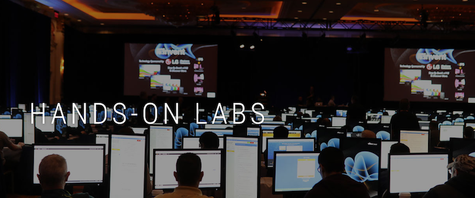

セッションの合間の空いた時間はハンズオンラボです。
ここでは普段クレジットを購入しないと受けられないオンライン学習ができます。日本のAWS Summitとかでもあるのと同じです。
手を動かしてわからないところがあれば、すぐ質問できます。しかも無料！素晴らしいですね。

[ACG AWS re:Invent 2017 - Day 3 Summary](https://youtu.be/nheO4wTcoZo)

 
# 4日目(11/30)
あっという間の4日目。夜はre:Playパーティーもあり実質の最終日です。

## KEYNOTE - Werner Vogels

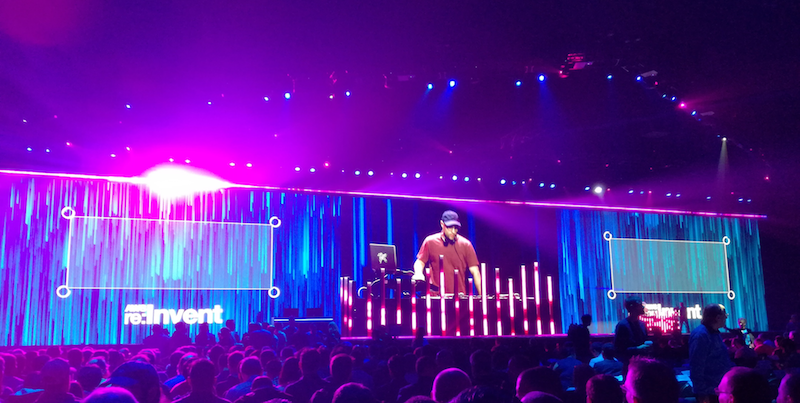

例年だと、この日も新サービスが発表されます。どちらかといえば技術寄りの。

**[一覧]**
・[Alexa for Business](https://aws.amazon.com/jp/alexaforbusiness/)
・[AWS Cloud9](https://aws.amazon.com/jp/cloud9/)
・[AWS Serverless Application Repository](https://aws.amazon.com/jp/serverless/serverlessrepo/)
・[Amazon API Gateway VPC integration](https://aws.amazon.com/jp/about-aws/whats-new/2017/11/amazon-api-gateway-supports-endpoint-integrations-with-private-vpcs/)
・[AWS Lambda Concurrency Controls](http://docs.aws.amazon.com/ja_jp/lambda/latest/dg/concurrent-executions.html)
・[AWS Lambda 3GB Memory Support](https://aws.amazon.com/jp/about-aws/whats-new/2017/11/aws-lambda-doubles-maximum-memory-capacity-for-lambda-functions/)
・[AWS Lambdd .Net Core2.0 Language Support](https://aws.amazon.com/jp/blogs/developer/aws-and-net-core-2-0/)
・AWS Lambda Go Language Support

例年と比べると彼が発表した新サービスは少ない気がしますが、ですがなんといってもCloud9！すっかり存在を忘れてただけにこれは衝撃でしたwごめんなさいorz
あとはまだpre-announceですがLambdaのGo言語サポートも会場を湧かせました。

[Keynote: Werner Vogels - Movie](https://youtu.be/nFKVzEAm-ts)

## CON333: Deep Dive into AWS Fargate
AWS Fargateは今回のre:Invetnで発表された新サービスで、dockerを利用する際に必要なEC2クラスター管理から解放してくれるサービスです。
ユーザーはTask Definitionというタスク定義でdockerイメージやCPU/Memoryなどのリソース、NWなどを定義します。
このセッションではそういった定義について管理画面を通してではなくJSON形式の定義ファイルとaws-cliを使って説明していました。

## ENC0105:Japan Wrap-Up Session

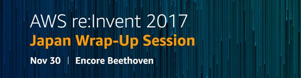

今までの新サービス/新機能をまとめたセッションです。AWSの方がJapanというだけあってもちろん日本語でまとめてくれています。
re:Inventで学んでWrap-Upで復習。振り返りとしてはとても良いセッションでした。

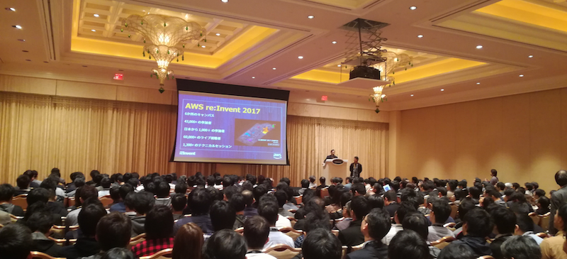

## re:Play

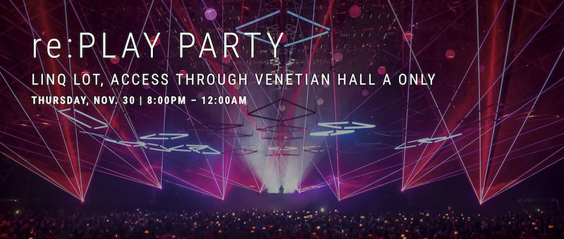

いよいよイベントも明日が最終日ということで打ち上げです。はじめの頃はイベントホールでの開催だったのが参加人数増加のため入りきらなくなり、隣のLinQというホテルの駐車場？にでっかいテントを３棟建てて開催です。イメージとしてはフェスみたいな感じです。そこにゲームセンターやアクティビティがあちこちに配置されているので、参加者は飲んだり食べたりします。
中央のテントにはLive用ステージを設置し、毎年有名なDJを呼んでLiveも行います。
誰がDJとしてくるのかは当日のKeynoteでWerner Vogelsが発表するまでわかりません。

[過去のDJ]
2013年 DeadMau5
2014年 Skrillex
2015年 Zedd
2016年 Martin Garrix

今年は。。。DJ Snake！レディー・ガガの「Born This Way」で有名なベテランDJです。

[ACG AWS re:Invent 2017 - Day 4 Summary](https://youtu.be/IhMOjBh3dqw)

 
# 5日目(12/1)

なんだかんだで最終日。前日のre:Playで夜遅くまで遊んだので、ゆるーい感じです。なので最終日を参加せずに帰路につく人も少なくはないです。

## HANDS-ON-LABS
自分の帰国は12/2だったためHands-On-Labsを受けて終了にしました。

 
# おわりに
年々規模が大きくなっていくre:Invent。以前は予約とかもなく、とにかく行ってその場で興味のあるセッションを聴くとかでも十分回り切れたのですが、今ではセッションが予約制になっています。自分は前日などにセッションを調べて予約などしてたのですが、聴きたかったAlexaやServerless関連は人気でなかなか参加することができませんでした。会場が増えたこともあり会場が離れている場合は移動で諦めないといけないセッションもありました。
来年からは「目的」を決め、セッション予約やスケジューリングをしっかりしたいと思いました。

